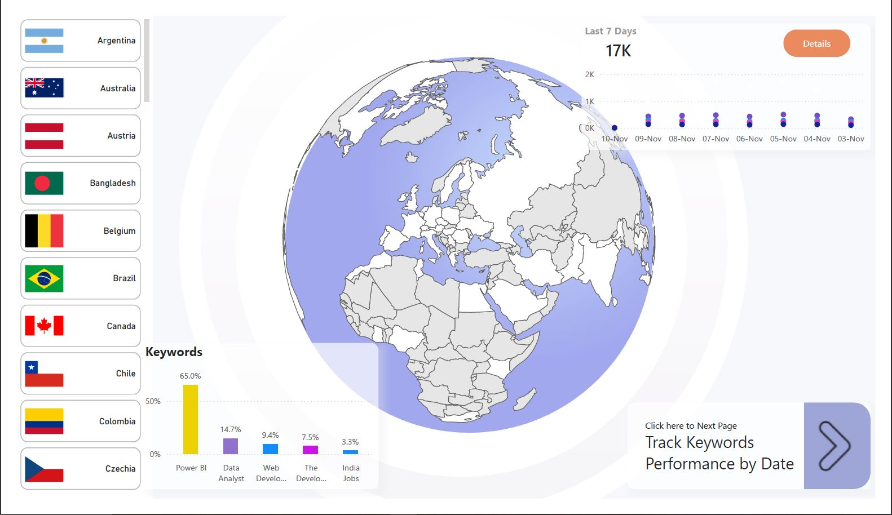

# Power BI Dashboard: Google Trends Insights

This Power BI dashboard utilizes the [SERP API](https://serpapi.com/) to analyze Google Trends data for various job-related search terms in India, focusing on keywords like "Data Analyst," "The Developer," "Jobs," and "Power BI." It provides insights into interest over time, geographic distribution, and related topics to help understand job demand trends.



## Table of Contents

- [Overview](#overview)
- [Features](#features)
- [Setup](#setup)
- [API Configuration](#api-configuration)
- [Usage](#usage)
- [Troubleshooting](#troubleshooting)
- [Contributing](#contributing)

## Overview

This Power BI dashboard is built to visualize Google Trends data and provide insights into the popularity and interest in specific job roles in India. It leverages the SERP API to fetch trend data, allowing you to explore interest over time, related search topics, and regional popularity.

## Features

- **Interest Over Time**: Displays trends in interest for specific job roles over a customizable time period.
- **Related Topics**: Identifies topics related to each search term.
- **Geographic Breakdown**: Shows interest by region across India.
- **Dynamic Refresh**: The dashboard can be refreshed to retrieve the latest data from Google Trends via the SERP API.

## Setup

### Prerequisites

- [Power BI Desktop](https://powerbi.microsoft.com/)
- A [SERP API account](https://serpapi.com/) and API key

### Getting Started

1. **Clone the Repository**:
   ```ruby
   git clone https://github.com/yourusername/your-repo-name.git
   cd your-repo-name
2. **Open the Power BI File: Open the .pbix file in Power BI Desktop to view and modify the dashboard**.

3. **Configure API Key: Update your SERP API key in Power Query following the instructions below**.

## API Configuration
### Add API Key in Power Query
1. In Power BI, go to Transform Data > Advanced Editor
2. Replace "Paste your Key" in the code with your actual SERP API key.

### API Parameters in Power Query
Adjust other parameters in Power Query such as q (query term) and date to customize the search terms and timeframe.

### API Call in Power Query 
Power Query M code to accomplish the task. This code defines an API call to the specified endpoint, builds the query parameters, and parses the JSON response to extract the relevant compared_breakdown_by_region data:
   ```ruby
  let
    // Define the API endpoint
    apiUrl = "https://serpapi.com/search.json",

    // Define the parameters
    queryParams = [
        engine = "google_trends", 
        q = "Data Analyst,The Developer,Jobs,India,Power BI",
        data_type = "GEO_MAP",
        date = "today 5-y",
        tz = "-330",
        api_key = "Paste your Key here"
    ],

    // Combine the endpoint and parameters
    fullUrl = apiUrl & "?" & Uri.BuildQueryString(queryParams),

    // Make the HTTP request
    response = Web.Contents(fullUrl),

    // Parse the JSON response
    jsonResponse = Json.Document(response),

    // Convert the response to a table
    dataTable = Table.FromRecords({jsonResponse}),

    // Extract the relevant data
    comparedBreakdownByRegion = dataTable{0}[compared_breakdown_by_region]
  in
    comparedBreakdownByRegion   
```
Code for past 7 days keywords performance data.
Power Query M code to generate the full URL with query parameters, fetch the JSON response, and extract the interest_over_time data from the JSON response.
```ruby
let
    // Define the base URL for the API call
    BaseUrl = "https://serpapi.com/search.json",

    // Define the query parameters
    QueryParams = [
        engine = "google_trends", 
        q = "Data Analyst,The Developer,Jobs,India,Power BI", 
        data_type = "TIMESERIES", 
        date = "all", 
        tz = "-330", 
        api_key = "Paste your Key here"
    ],

    // Generate the full URL with query parameters
    UrlWithParams = BaseUrl & "?" & Text.Combine(
        List.Transform(
            Record.FieldNames(QueryParams), 
            each _ & "=" & Uri.EscapeDataString(Text.From(Record.Field(QueryParams, _)))
        ), 
        "&"
    ),

    // Fetch data from the API
    JsonResponse = Json.Document(Web.Contents(UrlWithParams)),

    // Extract the "interest_over_time" part from the JSON response
    InterestOverTime = JsonResponse[#"interest_over_time"]
in
    InterestOverTime
```
Code for related keywords where you'll get two categories of data: Rising Keywords and Top Keywords.
Power Query M code to generate the full URL with query parameters, make the API call, parse the JSON response, and extract the interest_over_time data.
Keyword Limit : Maximum 1 Keywords can be passed
```ruby
let
    // Define the base URL for the API call
    BaseUrl = "https://serpapi.com/search.json",

    // Define the query parameters
    QueryParams = [
        engine = "google_trends", 
        q = "Data Analyst,The Developer,Jobs,India,Power BI", 
        data_type = "TIMESERIES", 
        date = "now 7-d", 
        tz = "-330", 
        api_key = "Paste your key here"
    ],

    // Generate the full URL with query parameters
    UrlWithParams = BaseUrl & "?" & Text.Combine(
        List.Transform(
            Record.FieldNames(QueryParams), 
            each _ & "=" & Uri.EscapeDataString(Text.From(Record.Field(QueryParams, _)))
        ), 
        "&"
    ),

    // Fetch data from the API
    JsonResponse = Json.Document(Web.Contents(UrlWithParams)),

    // Extract the "interest_over_time" part from the JSON response
    InterestOverTime = JsonResponse[#"interest_over_time"]
in
    InterestOverTime
```
## Usage
1. Refresh the Data:
   - In Power BI, click Refresh to retrieve the latest data from SERP API.
2. Customize Search Terms:
   - Edit the search terms or parameters within Power Query to adjust the data according to your needs.
3. View Insights:
   - Use the dashboard to explore trends, related topics, and regional interest.

## Troubleshooting
  - API Errors: If the dashboard doesn’t load data, check that your SERP API key is correct and that the API usage limits       have not been exceeded.
  - Data Updates: Ensure Power BI has permission to access external data sources if the refresh does not work as expected.

## Contributing
  - Contributions are welcome! Please fork this repository, make your changes, and submit a pull request for review.
